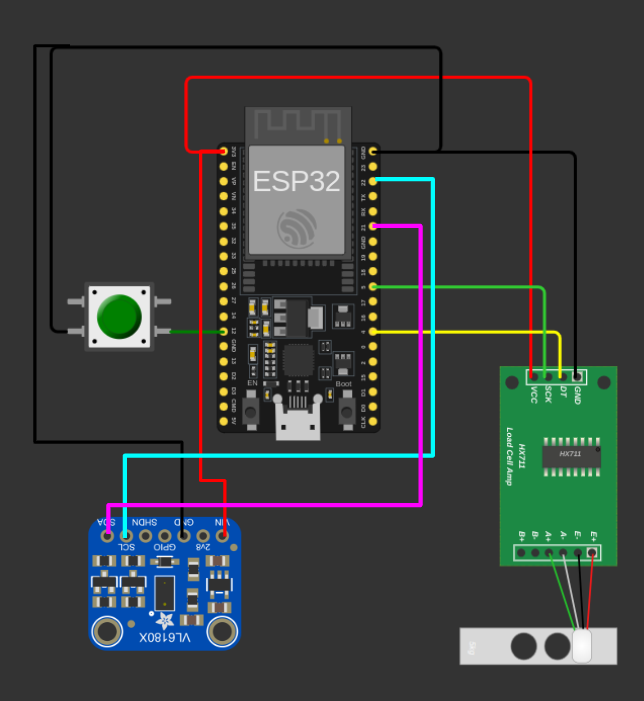

# Dinamométro con conexión a Google Sheet

Hemos diseñado la parte electrónica de un dinamómetro. Este dinamómetro está construido con una prensa hidraulica, para tomar las medidas se han utilizado dos sensores, uno para medir el desplazamiento del cilindro hidrauilico, un sensor de distancia Adafruit VL6180X, y como sensor de fuerza un célula de carga de 20kg.

Aquí podeis ver cuales son los sensores elegidos:

    
    

Como prensa hidraulica hemos utilizado la que se puede ver en la imagen:

    

y el montaje electrónico que se complementa con ESP32 ha quedado de la siguiente manera:

    

# Esquema electrónico

Para poder hacer que este montaje funcione, las conexiones electricas tienen que ser las que se pueden ver en el siguiente diagrama.

    

No hace falta decir que cada usuario puede cambiar los pines y poner los que desee, menos los pines 22 (SCL) y 21 (SDA) que corresponden a I2C del sensor de distancia VL6180X que estamos utilizando y que son necesarios para la comunicación con el mismo.

# Funcionamiento del programa

La secuencia de funcionamiento del software es el siguiente, al conectar la placa a la alimentación, lo primero que hará la placa es comprobar que todos los sensores están listos para usarse, así como la conexión a Internet. Una vez que esto sea correcto podremos ver que el led integrado en nuestra placa, en nuestro caso es azul, parpadea 5 veces. Esa indicación nos hace saber que la máquina está preparada para funcionar. En este momento ajustamos el cilindro lo más cerca de la pieza que vamos a testear y pulsamos el pulsador de MARCHA/PARO para que la prueba comienze. Tenemos nuestra máquina preparada para que empieze a dar datos. A partir de este momento movemos el cilindro poco a poco y en cada movimiento de 0,5mm enviará un dato a Google Sheet, con las distancia recorrida y la medición de la célula de carga. Sabremos que ha enviado un dato porque en cada envío el led azul parpadeará una vez. Seguimos con la prueba hasta que la pieza se rompa momento en el que pulsaremos el pulsador MARCHA/PARO para que se detenga la prueba con una indicación de 2 parpadeos del led. Ya tenemos la máquina parada y podemos hacer devolver el cilindro a su posición para comenzar una nueva prueba, en este momento no se envían datos a ningún sitio. La prueba se puede realizar tantas veces como se desée.

# Representación gráfica de los datos

Finalmente el resultado de los datos obtenidos es algo parecido a lo que aparece en el siguiente gráfico:

    

